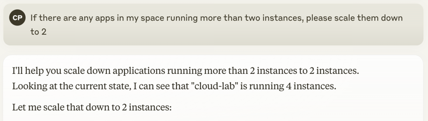

# Cloud Foundry MCP Server

This MCP Server provides an LLM interface for interacting with your Cloud Foundry foundation. It was built with the [Spring AI MCP](https://spring.io/blog/2024/12/11/spring-ai-mcp-announcement) project.



## Building the Server

```bash
./mvnw clean package
```

## Configuration

You will need to supply a configuration for the server for your MCP Client. Here's what the configuration looks like for [claude_desktop_config.json](https://modelcontextprotocol.io/quickstart/user):

```
{
  "mcpServers": {
    "cloud-foundry": {
      "command": "java",
      "args": [
        "-Dtransport.mode=stdio", "-Dlogging.file.name=/Users/pcorby/Desktop/pulse.webmvc.log", "-jar" ,
        "/path/to/cloud-foundry-mcp/target/cloud-foundry-mcp-0.0.1-SNAPSHOT.jar"
      ],
      "env": {
        "CF_APIHOST": "[Your CF API Endpoint e.g. api.sys.mycf.com]",
        "CF_USERNAME": "[Your CF User]",
        "CF_PASSWORD": "[Your CF Password]",
        "CF_ORG": "[Your Org]",
        "CF_SPACE": "[Your Space]"
      }
    }
  }
}
```
